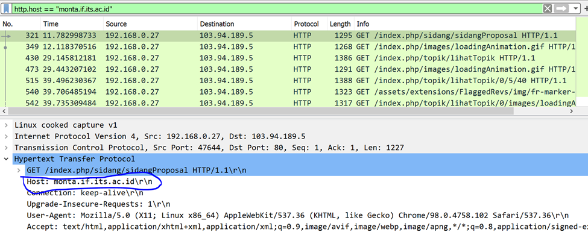
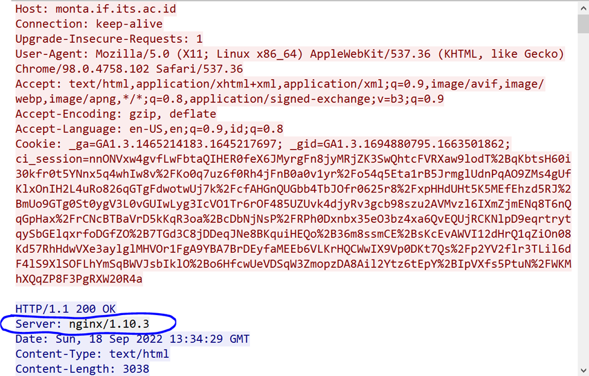
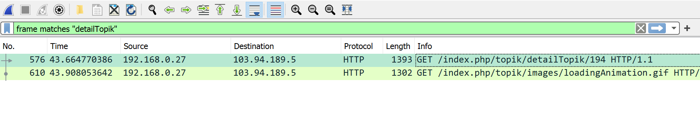
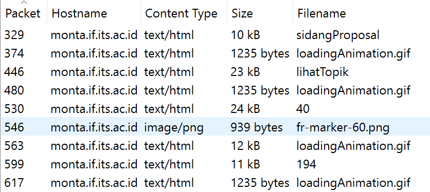

# Jarkom-Modul-1-F13-2022
Nama Anggota | NRP
------------------- | --------------
Hesekiel Nainggolan | 5025201054
Khuria Khusna | 5025201053
Afiq Akram | 5025201270

## Nomer 1
Sebutkan web server yang digunakan pada "monta.if.its.ac.id"! 

Solusi
Gunakan filter :

```
http.host == “monta.if.its.ac.id”
```

Maka akan muncul paket yang mengandung host `monta.if.its.ac.id`



Kemudian kami menggunakan `FOLLOW – TCP STREAM` untuk menampilkan webserver yang digunakan:




Jadi webserver yang digunakan adalah **nginx/1.10.3** 


## Nomer 2
Ishaq sedang bingung mencari topik ta untuk semester ini , lalu ia datang ke website monta dan menemukan detail topik pada website “monta.if.its.ac.id” , judul TA apa yang dibuka oleh ishaq ?

Solusi
pertama kita mencari lokasi dari judul TA dengan menggunakan `frame contains "detailTopik"` 



setelah kita mengetahui lokasi dari topik untuk TA, maka selanjutnya kita `extrak object-http`



kemudian kita download file lihatTopik, dan kemudian kita akan melihat judul TA yang tersedia:
```
Deteksi Sentimen pada Data Audio
Prediksi produk belanjaan
Cloud Provisioning dengan menggunakan OBL dan FSO
Cloud Provisioning dengan menggunakan OBL dan SSA
Cloud Provisioning dengan menggunakan GA-ANN
```

## Setelah Revisi

## Nomor 2
Pertama kita `export HTTP`, setelah itu kita dowbload file, kecuali yang bentuk gif. 


Kemudian kita save file tersebut dalam bentuk .html agar lebih mudah dalam pencarian judul TA
Akhrinya kita akan menemukan judul TA yang dibuka pada file `40.html`


