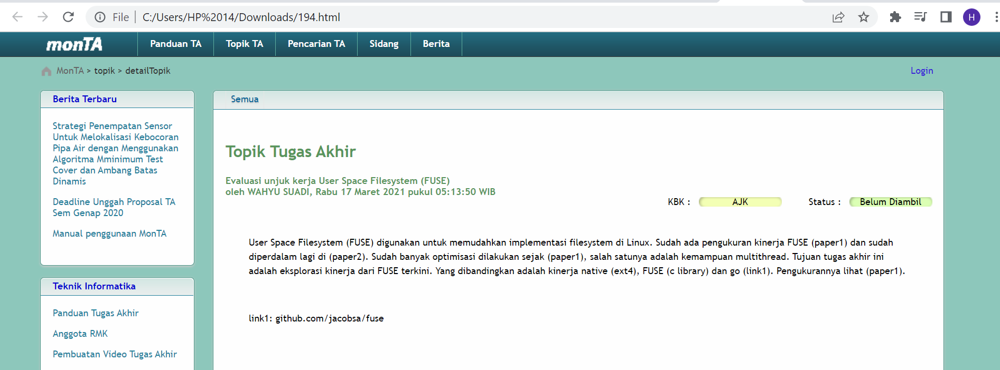
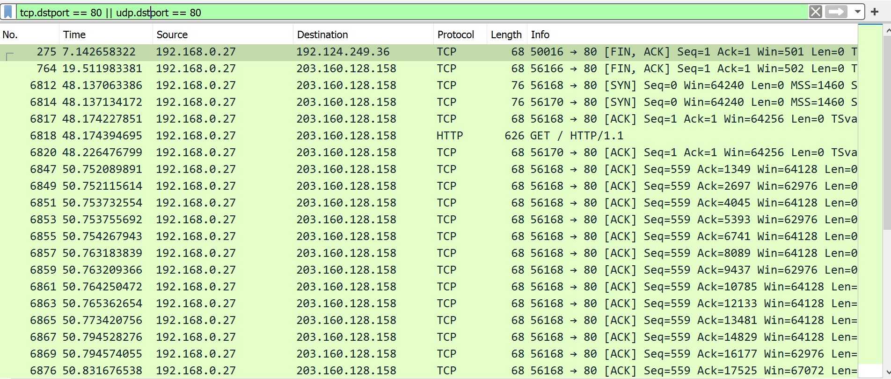
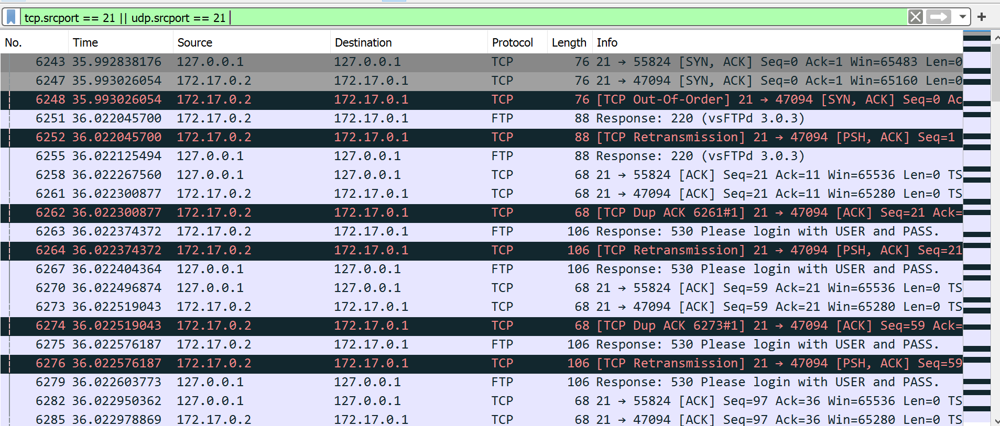
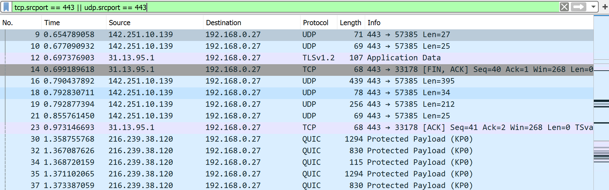
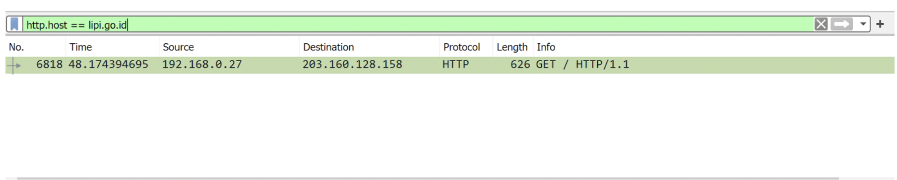
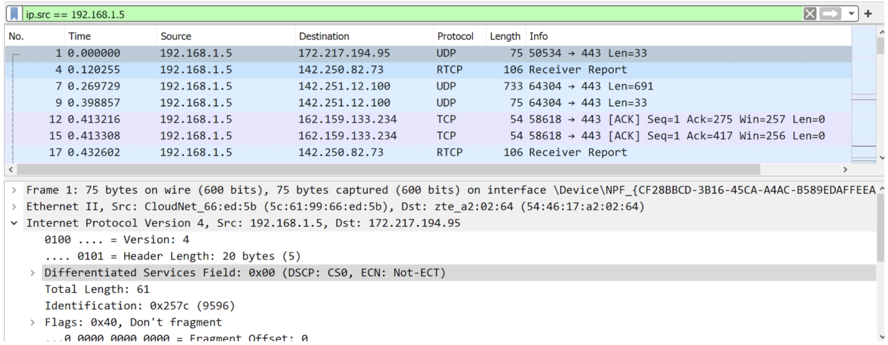
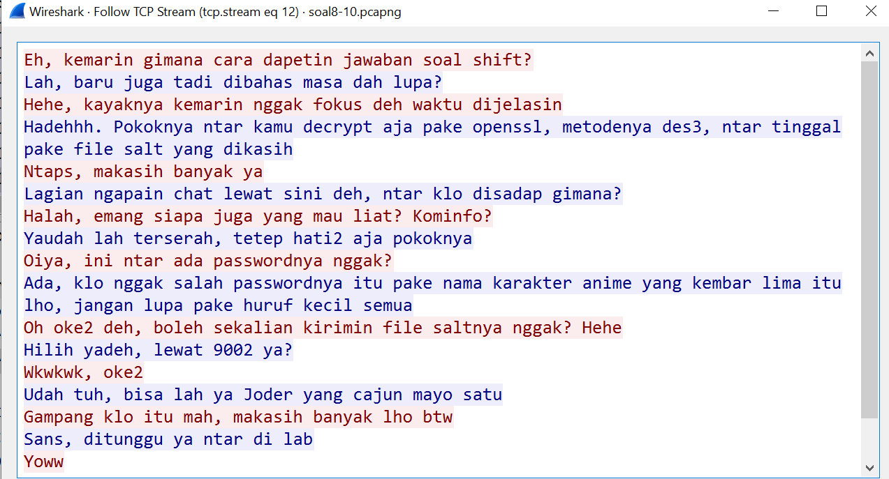
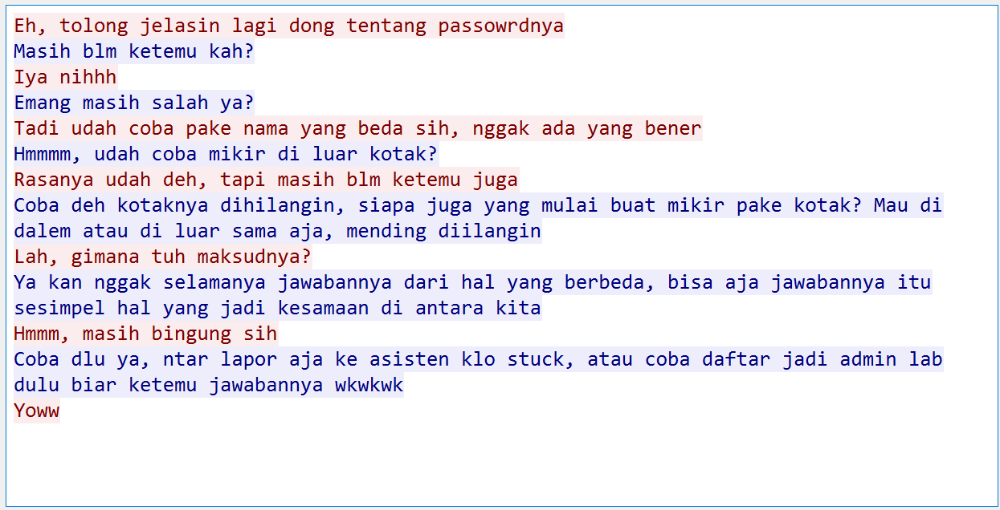
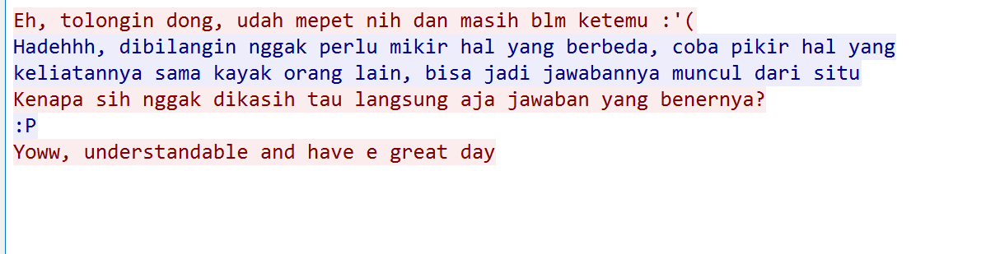
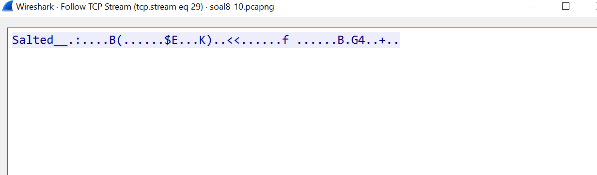

# Jarkom-Modul-1-F13-2022
Nama Anggota | NRP
------------------- | --------------
Hesekiel Nainggolan | 5025201054
Khuria Khusna | 5025201053
Afiq Akram | 5025201270

## Nomer 1
Sebutkan web server yang digunakan pada `monta.if.its.ac.id`! 

### Solusi
Gunakan filter :

```
http.host == “monta.if.its.ac.id”
```

Maka akan muncul paket yang mengandung host `monta.if.its.ac.id`


Kemudian kami menggunakan `FOLLOW – TCP STREAM` untuk menampilkan webserver yang digunakan:


Jadi webserver yang digunakan adalah **nginx/1.10.3** 


## Nomer 2
Ishaq sedang bingung mencari topik ta untuk semester ini , lalu ia datang ke website monta dan menemukan detail topik pada website `monta.if.its.ac.id` , judul TA apa yang dibuka oleh ishaq ?

### Solusi
pertama kita mencari lokasi dari judul TA dengan menggunakan `frame contains "detailTopik"` 


setelah kita mengetahui lokasi dari topik untuk TA, maka selanjutnya kita `extrak object-http`


kemudian kita download file lihatTopik, dan kemudian kita akan melihat judul TA yang tersedia:
```
Deteksi Sentimen pada Data Audio
Prediksi produk belanjaan
Cloud Provisioning dengan menggunakan OBL dan FSO
Cloud Provisioning dengan menggunakan OBL dan SSA
Cloud Provisioning dengan menggunakan GA-ANN
```

## Setelah Revisi

## Nomor 2
Pertama kita `export HTTP`, setelah itu kita dowbload file, kecuali yang bentuk gif. 


Kemudian kita save file tersebut dalam bentuk .html agar lebih mudah dalam pencarian judul TA
Akhrinya kita akan menemukan judul TA yang dibuka pada file `194.html`



Maka akan terlihat bahwa topik TA yang dilihat adalah `Evaluasi unjuk kerja User Space Filesystem (FUSE)
oleh WAHYU SUADI, Rabu 17 Maret 2021 pukul 05:13:50 WIB`

## Nomor 3

Filter sehingga wireshark hanya menampilkan paket yang menuju port 80! 

### Solusi
untuk memfilter semua paket yang menuju port 80 maka menggunakan `display filter tcp.dstport == 80 || udp.dstport == 80`. Penggunaan `dst` dikarenakan paket yang `menuju`, maka digunakan `dst`.
Maka akan menampilkan paket - paket yang menuju `port 80`



## Nomor 4

Filter sehingga wireshark hanya mengambil paket yang berasal dari port 21!

### Solusi
untuk memfilter semua paket yang berasal dari port 21 maka menggunakan `display filter tcp.srcport == 21 || udp.srcport == 21`. Penggunaan `src` dikarenakan paket yang `berasal`, maka digunakan `src`.
Maka akan menampilkan paket - paket yang menuju `port 21`



## Nomor 5

Filter sehingga wireshark hanya mengambil paket yang berasal dari port 443!

### Solusi
untuk memfilter semua paket yang berasal dari port 443 maka menggunakan `display filter tcp.srcport == 443 || udp.srcport == 443`. 
Maka akan menampilkan paket - paket yang menuju `port 443`



## Nomor 6
Filter sehingga wireshark hanya menampilkan paket yang menuju ke `lipi.go.id`!

### Solusi
untuk memfilter semua paket yang menuju `lipi.go.id` kita menggunakan `http.host` dikarenakan alamat yang dituju berupa sebuah link, maka menggunakan `http.host`



## Nomor 7
Filter sehingga wireshark hanya mengambil paket yang berasal dari ip kalian!

### Solusi
untuk menemukan ip, maka dicari dahulu menggunakan `cmd IPconfig`, maka akan didapat ip address milik kita. kemudian buka wireshark, kemudian ketik `ip.src` pada display filter dengan alamat yang dituju merupakan alamat ip yang sudah didapat.



## Nomor 8
Telusuri aliran paket dalam file .pcap yang diberikan, cari informasi berguna berupa percakapan antara dua mahasiswa terkait tindakan kecurangan pada kegiatan praktikum. Percakapan tersebut dilaporkan menggunakan protokol jaringan dengan tingkat keandalan yang tinggi dalam pertukaran datanya sehingga kalian perlu menerapkan filter dengan protokol yang tersebut.


### Solusi
karena menggunakan protokol jaringan dengan tingkat tinggi, kita menggunkan protokol tcp pada display filter untuk mencari port berapa percakapan dilakukan. kemudian kita akan mengecek satu persatu melalui follow-tcp-stream untuk melihat percakapan:

tcp.stream eq 12



tcp.stream eq 41



tcp.stream eq 90



## Nomor 9
Terdapat laporan adanya pertukaran file yang dilakukan oleh kedua mahasiswa dalam percakapan yang diperoleh, carilah file yang dimaksud! Untuk memudahkan laporan kepada atasan, beri nama file yang ditemukan dengan format [nama_kelompok].des3 dan simpan output file dengan nama “flag.txt”.

### Solusi
Berdasarkan percakapan yang dilakukan kita tahu port berapa file tersebut berada, yaitu berada pada port `9002`.
Maka selanjutnya kita cari filenya pada `tcp.port == 9002`.



kemudian kita save file tersebut dengan, nama file yang ditemukan dengan format F13.des3 dan simpan output file dengan nama `flag.txt`.

## Nomor 10
Temukan password rahasia (flag) dari organisasi bawah tanah yang disebutkan di atas!

### Solusi
karena pada percakapan diberitahu bahwa password nya berupa `nama karakter anime yang kembar lima`, maka kemungkinan bahwa passwordnya adalah Nakano
